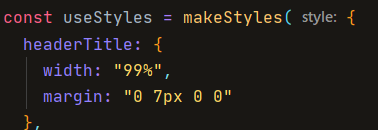
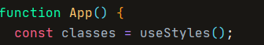

## 2. Stylisation d'App.js 

Commençons par donner un style général avant de styliser le métronome et le système specs en eux-mêmes.

### 1. Importation

Avant de mettre les mains dans le cambouis, démarrez en important tout ce dont vous aurez besoin pour styliser le métronome d'une façon générale:

1. {makeStyle}
2. {createMuiTheme}
3. {Grid}
4. Paper
5. AppBar
6. Button
7. Toolbar
8. Typography
9. Box

- Dans un premier temps, on définit un thème pour pouvoir utiliser le primary et secondary color.
- Ensuite, il faut créer la variable pour stocker tous les éventuels styles que l'on souhaite appliquer
  Votre code devrait ressembler à cela:

- Une fois que cela est fait, ouvrez votre composant App qui contient la variable **classes** dans laquelle il y aura toutes nos classes:

- On applique le thème pour tout le composant, ce qui rend la **couleur primary** et **secondary** actives

[◀ Previous step](README.md) 🤨 [Next step ▶](slider.md)
