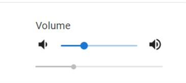
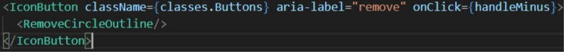
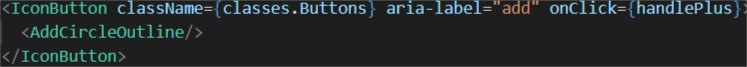
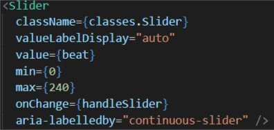

## 3. Stylisation du slider du métronome

Material UI propose différents sliders que l'on peut retrouver [ici](https://material-ui.com/components/slider/). Parmi ceux proposés, nous avons choisi d'utiliser le **continuous slider**.

### 1. Importation 
Pour commencer, on importe les différents éléments dont on aura besoin pour styliser le slider du métronome dans le fichier **metronome.js**: 

- Création de style: `import {makeStyles} from "@material-ui/styles";`
- Le slider: `import Slider from '@material-ui/core/Slider';`
- La sorte de background des boutons: `import IconButton from '@material-ui/core/IconButton';`
- L'icône pour diminuer: `import RemoveCircleOutline from '@material-ui/icons/RemoveCircleOutline';`
- L'icône pour augmenter: `import AddCircleOutline from '@material-ui/icons/AddCircleOutline';`

Une fois que tout est importé, nous pouvons passer à la suite 😋. 

### 2. Création du slider

Pour créer le slider, bonne nouvelle, vous l'avez déjà importé grâce à `import Slider from '@material-ui/core/Slider';` 😎

### 3. Appliquer les propriétés CSS au slider
 
Pour pouvoir gérer notre propre style, créez une fonction `makeStyle({})` que l'on stockera dans une variable **useStyle** --> **`const useStyle = makeStyle({})`**. C'est dans celle-ci que l'on pourra modifier le style de notre slider, en utilisant des noms de classes afin de donner différentes propriétés CSS que l'on pourra appliquer par la suite. 

- Stockez votre fonction **useStyle()** dans une const que vous appellez classes. Cela permettra d'appliquer le style au slider --> `const classes = useStyle();`

### 4. Le slider

Maintenant que tout cela est fait, nous pouvons passer aux choses sérieuses! 😏
Tout d'abord, dans la const **handleSlider**, ajoutez comme deuxième paramètre `setBeat(newValue);`. 
Ensuite dans le <**return()**>, en dessous du <**h3**>, créez une <**div**> dans laquelle vous intégrez votre `<IconButton></IconButton>`. Donnez 3 props à <**IconButton**>: 
1. className={}
2. aria-label=""
3. onChange={}
 
Dans `<IconButton>`, intégrer votre icône du signe moins: `<RemoveCircleOutline/>`.
Voilà le résultat que vous devriez avoir jusqu'à présent:

Intégrer maintenant le slider: `<Slider/>`.

Pour l'icône qui permet d'augmenter le rythme, procédez de la même manière que lorsque vous avez intégré l'icône pour diminuer le rythme:

Revenons à ce fameux slider... 🤯
Passez lui différentes props:

1. className={}
2. valueLabelDisplay=""
3. value={}
4. min={}
5. max={}
6. onChange={}
7. aria-labelledby=""

De manière à ce que le code final ressemble à cela: 

Voilà, le slider est fonctionnel et stylisé ! 🤩

[◀ Previous step](app.md) 🤨 [Next step ▶](systemspec.md)

