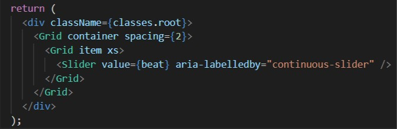
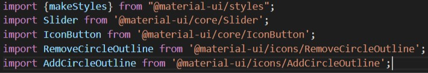

## 3. Stylisation du slider du métronome

Material UI propose différents sliders que l'on peut retrouver [ici](https://material-ui.com/components/slider/). Parmi ceux proposés, nous avons choisi d'utiliser le **continuous slider**.

### 1. Importation 
Pour commencer, on importe les différents éléments dont on aura besoin pour styliser le slider du métronome: 

- Création de syle: `import {makeStyles} from "@material-ui/styles";`
- Le slider: `import Slider from '@material-ui/core/Slider';`
- La sorte de background des boutons: `import IconButton from '@material-ui/core/IconButton';`
- L'icône pour diminuer: `import RemoveCircleOutline from '@material-ui/icons/RemoveCircleOutline';`
- L'icône pour augmenter: `import AddCircleOutline from '@material-ui/icons/AddCircleOutline';`

Une fois que tout est importé, nous pouvons passer à la suite 😋. 

### 2. Création du slider

Pour créer le slider, nous allons créer un nouveau fichier que l'on va appeler **Slider.js**. Dans celui-ci, nous allons simplement récupérer le slider que l'on désire depuis Material UI. On le modifiera par la suite dans **metreonome.js** afin de le rendre fonctionnel et plus joli.

- Créez le ficher **Slider.js** dans votre dossier **src**
- Importez **React**
- Importez le **grid** et le **slider** depuis Material UI en utilisant à chaque fois **import ... from '@material-ui/core/...'** 
- Récupérez le code depuis [la page des sliders sur Material UI](https://material-ui.com/components/slider/) mais ne gardez que cette partie: 

### 3. Modification du fichier metronome.js

Maintenant que notre slider est créé dans le fichier **Slider.js**, nous pouvons l'importer dans notre fichier **metronome.js** et le faire fonctionner.

- Importez plusieurs choses comme suit: 

 
Pour pouvoir gérer notre propre style, créez une fonction que l'on stockera dans une variable **`const useStyle = makeStyle({})`**. C'est dans celle-ci que l'on pourra modifier le style de notre slider. Dans cette fonction, nous pourrons utiliser des noms de classes afin de donner différentes propriétés CSS que l'on pourra appliquer par la suite. 

- Dans la const **handleSlider**, ajoutez comme deuxième paramètre `setBeat(newValue);`
- Stockez votre fonction **useStyle()** dans une const que vous appellez classes. Cela permettra d'appliquer le style au slider --> `const classes = useStyle();`

### 4. Le slider

Maintenant que tout cela est fait, nous pouvons passer aux choses sérieuses! 😏
Dans le **return**, en dessous du **h3**, créez une **div** dans laquelle on va intégrer notre `<IconButton></IconButton>`. Donnez 3 props à **IconButton**: 
1. className={}
2. aria-label="remove"
3. onChange={handleMinus}

Dans le tag IconButton, intégrer votre icône du signe moins de cette façon: `<RemoveCircleOutline/>`.
Voilà le résultat que vous devriez avoir jusqu'à présent:

Intégrer maintenant le slider: `<Slider/>`.

Pour l'icône qui permet d'augmenter le rythme, procédez de la même manière que lorsque vous avez intégrer l'icône pour diminuer le rythme:

Revenons à ce fameux slider... 🤯
Passez lui différentes props de manière à ce que le code final ressemble à cela: 

Voilà, le slider est fonctionnel et stylisé ! 🤩

[◀ Previous step](app.md) 🤨 [Next step ▶](systemspec.md)

